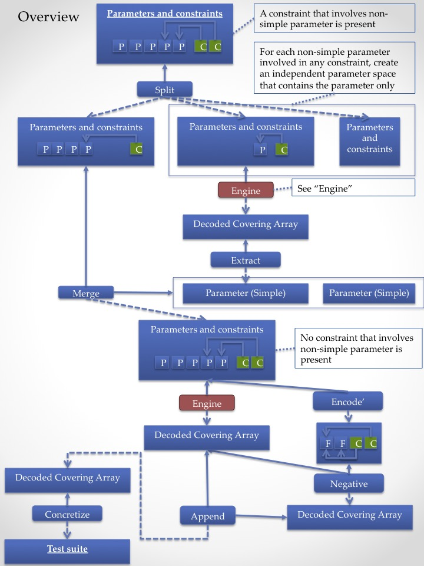
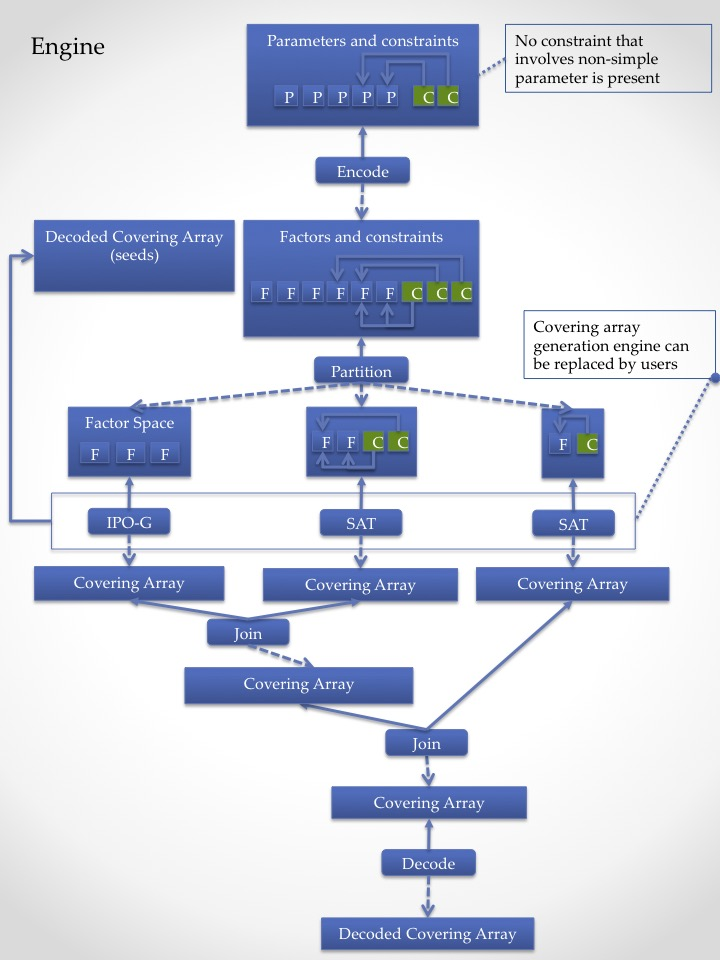

 is a model based testing tool powered by combinatorial testing techniques.

# Introduction: Renewal of JCUnit
The last month (Mar/2017) I attended and made a presentation about JCUnit
at [ICST 2017](http://aster.or.jp/conference/icst2017/)(IEEE Conference on Software Testing 2017)
and got a lot of new findings and feedbacks from it. It was an exciting
experience for me and I realized that it's time to re-design JCUnit now
based on new ideas.

Followings are new features that will be introduced to JCUnit in the next
major release, 0.8.x.

* Annotation Renewal
* Pipeline Renewal
    - New pipeline design
    - API
* New covering array engine
    - "IPO-G+"

It will no longer be working with old Java SE6 and require Java 8. Neither
it will not be compatible with older versions of JCUnit. The new version is
called "JCUnit 8" named after both Java 8 and the next major version of JCUnit,
0.8.x. Not only that, functionalities of older versions are removed from
JCUnit8.

## About 0.7.x
0.7.x of JCUnit will remain available and you can keep using it but all
new features will be introduced to JCUnit8 (0.8.x or later), not to 0.7.x or
older.

### Installation and how to use it.
It is tested using ```JUnit``` (4.12) and ```mockito-core``` (1.9.5).

You will only need to link JCUnit to your project.
Below is a pom.xml fragment to describe jcunit's dependency.
Please add it to your project's pom.xml

```xml

    <dependency>
      <groupId>com.github.dakusui</groupId>
      <artifactId>jcunit</artifactId>
      <version>[0.7.0,)</version>
      <scope>test</scope>
    </dependency>
    <dependency>
      <groupId>junit</groupId>
      <artifactId>junit</artifactId>
      <version>4.12</version>
      <scope>test</scope>
    </dependency>
```

That's it. Let's go.


* **NOTE:** Please use JCUnit with JUnit 4.12 (or later). Otherwise JCUnit will not be able to execute tests for failing to instantiate parameterized runner.
* **NOTE:** Source code is found here:[0.7.x-develop branch](https://github.com/dakusui/jcunit/tree/0.7.x-develop)
* **NOTE:** Documentation is found here:[Wiki (0.7.x)](https://github.com/dakusui/jcunit/wiki/0.7.x)
## About 0.8.x
0.8.x and later is actively being developed right now and will be called **JCUnit8**.
It will require Java SE8 or later.

Major chanes are planned in 0.8.x including move to Java 8, redesigning
pipeline mechanism, etc., most of which are incompatible with older versions.

Implementation of the features have almost finished already and they will
be walked through one by one in this document.

### Installation and how to use it.
Please use following dependencies to use **JCUnit8**.

```xml

    <dependency>
      <groupId>com.github.dakusui</groupId>
      <artifactId>jcunit</artifactId>
      <version>[0.8.1,)</version>
      <scope>test</scope>
    </dependency>
    <dependency>
      <groupId>junit</groupId>
      <artifactId>junit</artifactId>
      <version>4.12</version>
      <scope>test</scope>
    </dependency>
```

* **NOTE:** Please use JCUnit with JUnit 4.12 (or later). Otherwise JCUnit will not be able to execute tests for failing to instantiate parameterized runner.
* **NOTE:** Source code is found here:[0.8.x-develop branch](https://github.com/dakusui/jcunit/tree/0.8.x-develop)

### Annotation Renewal

In JCUnit8, its annotation system was completely renewed. You can find an
example of the new annotation style [here](/src/java/test/com/github/dakusui/jcunit8/examples/BankAccountExample.java).

These days, people more and more tend to prefer ['@Theories' style](http://junit.org/junit4/javadoc/4.12/org/junit/experimental/theories/Theories.html),
where each test method takes parameters to each of whose actual value is
assigned by a test runner, over conventional JUnit style. Newly introduced
annotation system takes the approach.

Followings are the annotations used in the new style.

* Defining a test class
    * ```@Runwith(JCUnit8.class)```
    * ```@ConfigureWith```
* Defining a test method
    * ```@Test```
    * ```@Given```
    * ```@From```
* Defining a test space
    * ```@ParameterSource```
    * ```@Condition```

These will be explained in this section.

#### Defining a test class
The new test runner is called **JCUnit8** (```com.github.dakusui.jcunit8.runners.junit4.JCUnit8```).
When you use the runner, a configuration factory for the test class can
be specified it with another annotation ```@ConfigureWith```. With it, you
can control various features of **JCUnit** such as negative test generation,
test suite strength, etc.


```java

    @RunWith(JCUnit8.class)
    @ConfigureWith(BankAccountExample.BankAccountConfigFactory.class)
    public class BankAccountExample {
        ...

```

You can also configure a class from which parameters, constraints, and
non-constraint conditions are generated using ```parameterSpace``` attribute.

#### Defining a test method

Methods annotated with ```@Test``` are considered to be test methods, but
unlike conventional JUnit test methods, they can take parameters. But each of
those parameters must be annotated with ```@From```, which specifies how
actual argument values of the parameter should be supplied.


```java

      @Test
      @Given("overdraftNotHappens")
      public void whenPerformScenario$thenBalanceIsCorrect(
          @From("scenario") List<String> scenario,
          @From("depositAmount") int amountOfDeposit,
          @From("withdrawAmount") int amountOfWithdraw,
          @From("transferAmount") int amountOfTransfer
      ) {
          ...
      }

```


```@From``` annotations specify a name of method defined from which actual parameter
values should be generated. Those methods must be defined in a class specified by
```@ConfigureWith#parameterSpace```.

* **NOTE:** Unlike previous versions, you will not need to use ```@Uses```
annotations anymore because the factors used in your test method are already
declared by parameter definitions.

##### Associating test cases and test oracles

Expected behaviours of test cases can be different depending on inputs of
them. E.g., when a sequence of bank account operations is executed, the
expected outcome will be different depending on whether an overdraft happens
or not.

In JCUnit8, this can be expressed by using ```@Given``` annotation.

A ```@Given``` annotation specifies a condition on which this test method
should be executed. In the example above, the test method ```whenPerformScenario$thenBalanceIsCorrect```
will be invoked when (and only when) a method ```overdraftNotHappens```, defined
in the class specified by ```@ConfigureWith#parameterSpace``` attribute,
returns ```true```.

Currently JCUnit allows you to create composite conditions using three
operators, AND, OR, and NOT from simple ones. With them, you should be able
to express any boolean forms in theory (because you can transform any boolean
form into [DNF](https://en.wikipedia.org/wiki/Disjunctive_normal_form))

But parentheses cannot be used.

If you want to express ANDed conditions, you can do it by following.

```java

      @Test
      @Given("condition1&&condition2")
      public void aTestMethod(...) {
          ...
```

To express ORed conditions,

```java

      @Test
      @Given({"condition1", "condition2"})
      public void aTestMethod(...) {
          ...
```

And to negate a condition, you can do

```java
      @Test
      @Given({"!condition1", "condition2&&!condition3"})
      public void aTestMethod(...) {
          ...
```


As mentioned already, parentheses are not supported and you cannot write a condition like this.

```java

   @Given("(condition1||!condition2)&&condition3")
```

You will need to rewrite this to following.

```java

   @Given({"condition1&&condition3", "!condition2&&condition3"})
```

#### Defining a test space
The model from which JCUnit generates test cases consists of three elements
which are

* Parameters
* Constraints
* Test oracles

Test oracles are defined as methods in a test class and associated with test cases
using ```@Given``` annotations. In this section it will be discussed how to define
parameters and constraints.

##### Defining a parameter
When you can list actual values of a parameter and it's sufficient, you can
(and should) use "Simple" parameter model. Following is an example.

```java

        @ParameterSource
        public static Simple.Factory<Integer> depositAmount() {
          return Simple.Factory.of(asList(100, 200, 300, 400, 500, 600, -1));
        }
```

The annotation ```@ParameterSource``` tells JCUnit that it is a method
that supplies actual values of parameter ```depositAmount``` (method name).
```@From``` annotations reference methods defined in a class that implements
```Config.Factory``` and is referred to by ```@ConfiguredWith``` annotation.

A method annotated with ```@ParameterSource``` must return a factory of a
parameter class. And the parameter object created by the returned factory
should hold actual values to be used in the generated test suite.

When you want to use a simple parameter, it can be done just by doing

```java

          return Simple.Factory.of(asList(100, 200, 300, 400, 500, 600, -1));
```

The values ```100```, ```200```, ```300```, ..., passed to ```(Arrays.)asList``` are values
that you can use the parameter ```depositAmount```.


##### Defining a constraint and a condition
To define a constraint, you can do following.

```java
        @Condition(constraint = true)
        public static boolean overdraftNotHappens(
            @From("scenario") List<String> scenario,
            @From("depositAmount") int amountOfDeposit,
            @From("withdrawAmount") int amountOfWithdraw,
            @From("transferAmount") int amountOfTransfer
        ) {
          return calculateBalance(scenario, amountOfDeposit, amountOfWithdraw, amountOfTransfer) >= 0;
        }

```

When you want to make it a non-constraint-condition, you can omit the
attribute ```constraint``` or explicitly set the value to ```false```.


```java
        @Condition(constraint = false)
        public static boolean overdraftNotHappens(
```

* **NOTE:** Unlike previous versions, you will not need to use ```@Uses```
annotations anymore because the factors used in your test method are already
declared by parameter definitions.

### Pipeline Renewal
The test suite generation pipeline of JCUnit was completely redesigned.

In the new JCUnit style, users will define "parameters" using models,
such as FSM or Regex, and constraints over them first, and then they will
be converted into factors and constraints.

One parameter can be turned into multiple factors. For instance, from a
regex ```A(B|C){0,3}``` parameter can be turned into 10 factors and 9
constraints that look like following.

```
    REGEX:regex1:alt-5:[(VOID), [B], [C]]
    REGEX:regex1:alt-6:[(VOID), [B], [C]]
    ...
    REGEX:regex1:cat-14:[[[A], Reference:<REGEX:regex1:rep-13>]]

    constraint([REGEX:regex1:rep-13]->REGEX:regex1:alt-5)
    constraint([REGEX:regex1:cat-8]->REGEX:regex1:alt-6)
    ...
    constraint([REGEX:regex1:cat-14]->REGEX:regex1:rep-13)
```

After all the parameters and constraints are converted to factors and
constraints, factors and constraints are grouped based on how constraints
 are referring to factors so that each group can be processed independently.

#### Overview
Following is a diagram that illustrates the entire flow of JCUnit8 pipeline
from user input, parameters and constraints, to the system output, the
generated test suite.


Users sometimes want to define constraints that involve non-simple parameters.
For instance, if you define a parameter to describe a sequence of operations
using a regular expression model, maybe you want to exclude test cases where
overdrafts happen. To make it possible to generate tests from such a model,
JCUnit first converts eah non-simple parameter which involves a constraint
into a simple parameter. This conversion is done by a sub-pipeline called
"Engine".

The box "Engine" will be discussed later in more detail.

#### "Engine"
The "Engine" stage is a main component of the entire test suite generation
 pipeline. It takes 'preprocessed' parameters and constraints and generates
 a covering array of required strength any of whose element does not violate
 any of given constraints.

This stage is not designed to handle parameters that are involved in any
constraints. It is because that we speculated that, if such a parameter is
included, the factors and constraints will not be partitioned efficiently
and covering array generation will take impractically long time.

To address this concerning, the pipeline designed to 'preprocess' the
non-simple parameters referenced by constraints to convert into simple ones
by applying "Engine" process for each parameter as if it is an independent
parameter space beforehand. (see "Overview")



After parameters and constraints are encoded into factors and constraints
that can be handled by implementations of ```com.github.dakusui.jcunit8.pipeline.stages.Generator```,
they will then be 'partitioned'.

In 'partition' step, factors will be grouped by constraints that involve
them, so that each group can be processed independently.

After all the groups are processed and therefore a small covering array is
generated for each group, those groups will be joined. After all joining
processes have finishes, you will have final covering array whose each tuple's
values can be decoded to actual values of parameters.

#### New covering array engine: "IPO-G+"
In JCUnit8, a new covering array generator that can handle
constraints, [IPO-G+](main/java/com/github/dakusui/jcunit8/pipeline/stages/generators/IpoG.java), was introduced.

Idea of the algorithm is simple. In conventional IPO-G algorithm, which is
shown below, new values are assigned at some points annotated with (*1) - (*4).
The IPO-G+ algorithm only searches for assignments which can become
valid at these points.

```
      Algorithm: IPOG-Test (int t , ParameterSet ps ) {
        1.  initialize test set ts to be an empty set
        2.  denote the parameters in ps , in an arbitrary order, as P1 , P2, ...,
            and Pn
        3.  add into test set ts a test for each combination of values of the first
            t parameters (*1)
        4.  for (int i = t + 1 ; i ≤ n ; i ++ ){
        5.     let π be the set of t -way combinations of values involving parameter
               Pi and t -1 parameters among the first i – 1 parameters (*2)
        6.     // horizontal extension for parameter Pi
        7.     for (each test τ = (v 1 , v 2 , ..., v i-1 ) in test set ts ) {
        8.         choose a value vi of Pi and replace τ with τ’ = (v 1 , v 2 ,
                   ..., vi-1 , vi ) so that τ’ covers the most number of
                   combinations of values in π (*3)
        9.         remove from π the combinations of values covered by τ’
        10.    }
        11.    // vertical extension for parameter P i
        12.    for (each combination σ in set π ) {
        13.      if (there exists a test that already covers σ ) {
        14.          remove σ from π
        15.      } else {
        16.          change an existing test, if possible, or otherwise add a new test
                     to cover σ and remove it from π (*4)
        17.      }
        18.    }
        19.  }
        20.  return ts;
       }
      See http://barbie.uta.edu/~fduan/ACTS/IPOG_%20A%20General%20Strategy%20for%20T-Way%20Software%20Testing.pdf
```


Checking if given assignments can become valid and iterating valid assignments
are done by following method.

```java

  public static Stream<Tuple> streamAssignmentsAllowedByConstraints(
      Tuple tuple,
      List<Factor> allFactors,
      List<Constraint> allConstraints
  ) {
```

This method streams assignments of factors, involved and allowed by given
constraints, not given by ```tuple```.

* **NOTE:** Right now performance of this algorithm is being optimized and
validated. And it might be re-desinged based on findings from the optimization
and validation.

### TODOs
* Validations
* Default value of '@ConfigureWith' annotation: If the test class is implementing
  ```Config.Factory``` interface, it might be good idea to use it as a value for
  '@ConfigureWith' annotation when it is absent.
* IPO-G+ performance improvements.
* FSM feature has already been implemented, but not yet tested in 0.8.x line.
* Make the pipeline execute its internal processes where possible.


# References

* [JCUnit wiki](https://github.com/dakusui/jcunit/wiki)
* [JCUnit blog; Japanese; 日本語](http://jcunit.hatenablog.jp/)

# Copyright and license #

Copyright 2013 Hiroshi Ukai.

Licensed under the Apache License, Version 2.0 (the "License");
you may not use this work except in compliance with the License.
You may obtain a copy of the License in the LICENSE file, or at:

  [http://www.apache.org/licenses/LICENSE-2.0](http://www.apache.org/licenses/LICENSE-2.0)

Unless required by applicable law or agreed to in writing, software
distributed under the License is distributed on an "AS IS" BASIS,
WITHOUT WARRANTIES OR CONDITIONS OF ANY KIND, either express or implied.
See the License for the specific language governing permissions and
limitations under the License.
