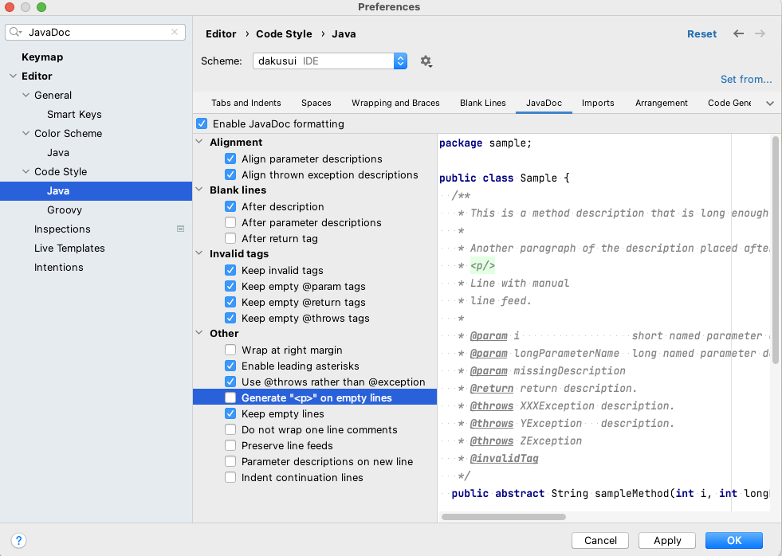

- **Please disable JavaDoc formatting:** We are using "asciidoclet", which renders asciidoc formatted content in JavaDoc.
Automatic code formatting may break ascii arts in the JavaDoc.
Also, please at least make sure that the `
` element is not inserted automatically (See <<JavaDocSetting>>).

.JavaDocSetting
[[JavaDocSetting]]
