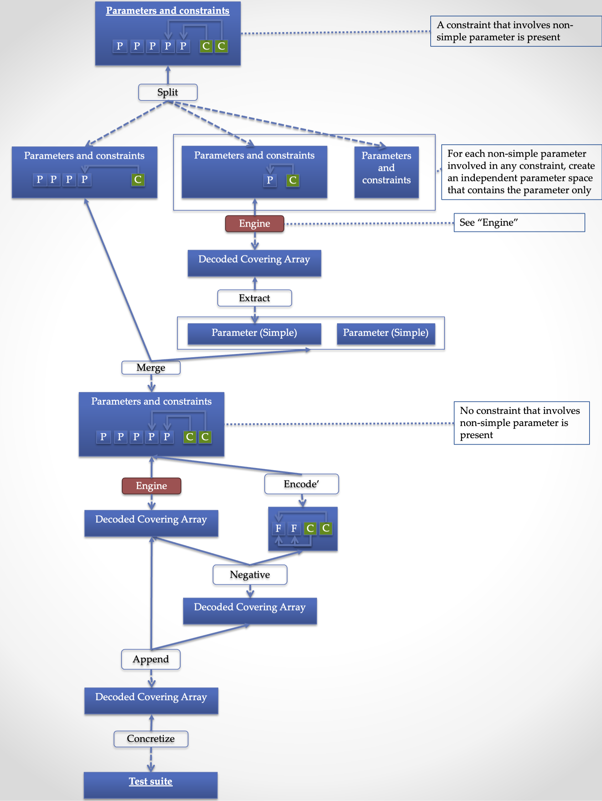
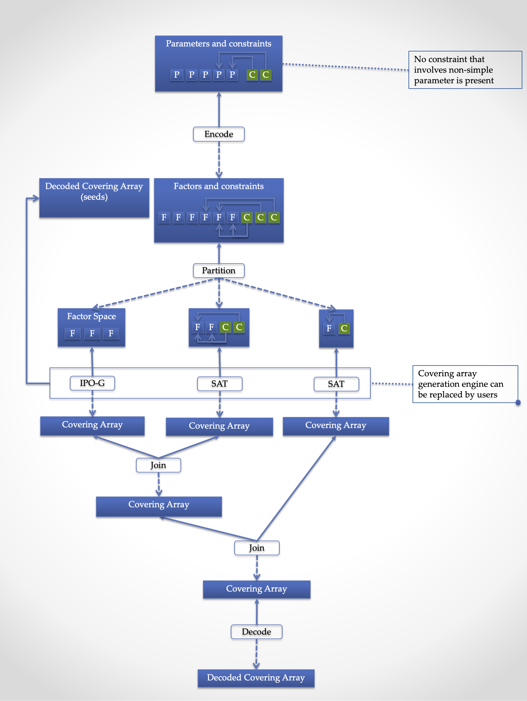

= Design of JCUnit

== The Pipeline

JCUnit has a pipeline, which converts user-defined parameters into an executable test suite.
Basic idea of it is following:
First, it converts the user-defined (human-understandable, high-level) parameters into factors and constraints, which can be processed by covering array generation engines.
Then, a covering array is generated from them.
Finally, the covering array is converted back to a test suite expressed in the human-understandable and high-level notation.

However, the inside the pipeline, it has several branches and stages in order to implement popular features of CIT tools (such as seeding and negative testing) or to achieve scalability along with the number of parameters and complexity of constraints.

=== Overview

(t.b.d.)

.Pipeline Overview

=== The "Engine" Pipeline

The "Engine" pipeline is responsible for generating a human-understandable test suite from a given human-understandable parameter model.

.Engine Pipeline

It is a broad concern in the model-based testing to address a problem called "state-space explosion".
To address this the approach, the JCUnit applies a technique called "Combinatorial Interaction Testing" to generate a small test with a good coverage over the testing domain.

==== Stages

This inner pipeline mainly consists of five stages, "Encode", "Partition", "Generation", "Join", and "Decode".

The high-level (human-understandable) parameter model is encoded into a model based on factors and constraints only in the first stage called "Encode".
The encoded factors and parameters are partitioned for the sake of scalability and flexibility.
For each partitioned group of factors and constraints, "Generation" stage, where CIT engine is executed to generate a mathematical object called a "covering array", is executed.

Then, covering arrays are connected by the "Join" stage.
As of today, the only practical way to construct a new covering array from existing ones without relying on covering array generation engine is a technique called "Combinatorial Join".
We use this technique in this stage.

Finally, the connected covering array is converted into the human-readable form by "Decode" stage.

In this section, we walk through the stages in the"Engine" pipeline, one by one.

===== Encode

This is a stage, where a parameter defined using a meta-model is converted into a set of factors and constraints.
The encoding procedure is provided as a part of each meta-model implementation.
Thanks to having this stage, JCUnit can handle various meta-models such as Input-parameter Model, Finite State Machines (FSM) Model, Regular Expression sequence, and so on.

===== Partition

"Partition" stage splits a given set of factors and constraints into groups each of which no constraint references a factor outside the group.
This stage allows us two things.
One is to apply the "best" covering array generation engine for each group.
The other is to be able to mitigate the exponential growth of generation time along with the number of factors/the complexity of constraints.

===== Generation

"Generation" is the stage, where a covering array is generated from factors and constraints.
As long as the factors and constraints can be handled, the engine implementation is replaceable.<<JCUnit-Issue-179>>

===== Join

JCUnit employs an operation called "Combinatorial Join"<<CombinatorialJoin>><<WP-CombinatorialJoin>> to construct a new covering arrays from existing ones not relying on a covering array generation array engine.
Since the combinatorial join operation can take onlyt two covering arrays as input, this stage is applied repeatedly.

===== Decode

"Decode" stage is responsible for convert the test cases generated using the levels back into the high-level representation,
i.e., a concrete value of the concrete value of a parameter given to "Encode" stage.
The decoding procedure is provided as a part of each meta-model implementation.

==== Future Considerations

In the "Engine" pipeline, there a few points, where an actual implementation executed at runtime can be customized by users.

1. Encoding/Decoding a meta-model
2. Partition strategy
3. Join order

In this section, we walk through them one by one to discuss our "default" implementation and points to consider when you customize these points.

===== Encoding/Decoding a meta-model

(t.b.d.)

===== Partition strategy

The default implementation for the "Partition" stage, extracts a group of factors which are not referenced by any constraints, first.
Then, it groups factors by constraints in the following manner.
It picks up one constraint and checks each factor if the factor is referenced by another constraint.
If it is, mark the factor and the check happens recursively for the referencing constraint.
Once this process is finished, the marked factors are extracted as a new group and the checked constraints are removed.
Until all the constraints are removed, the process is repeated.

The intention of this mechanism is to allow "divide-and-conquer" in the covering array generation process.
The encoding procedure may multiply the number of the factors and constraints.
Although the modern covering array generation engines are very scalable along with the number of factors, however, if once a constraint is introduced, the performance is drastically worsen, sometimes<<PICT-Issue-13>>.
JCUnit can mitigate this problem by this and "Join" mechanism.
Another benefit of having this step is to be able to choose the "best" covering array engine for each group.
For instance, when constraints are present, ACTS is faster than PICT.
However, if the constraints are not simple ones but relying on Java's feature to check the value's validity, JCUnit's built-in covering array engine will be the only choice, even if it is slowest among those three.

You should also keep in ming that the "Join" stage causes a significant "size penalty", where covering array size is increased significantly for each combinatorial join operation.

===== Join order

(t.b.d)

== References

- [[JCUnit-Issue-179]] https://github.com/dakusui/jcunit/issues/179[Integrate PICT as a covering array generation engine]
- [[CombinatorialJoin]] https://ieeexplore.ieee.org/document/8728961[Combinatorial Join]
- [[WP-CombinatorialJoin]] https://peerj.com/articles/cs-720.pdf[Accelerating covering array generation by combinatorial join for industry scale software testing]
- [[PICT-Issue-13]] https://github.com/Microsoft/pict/issues/13[Endless calculation with following model]