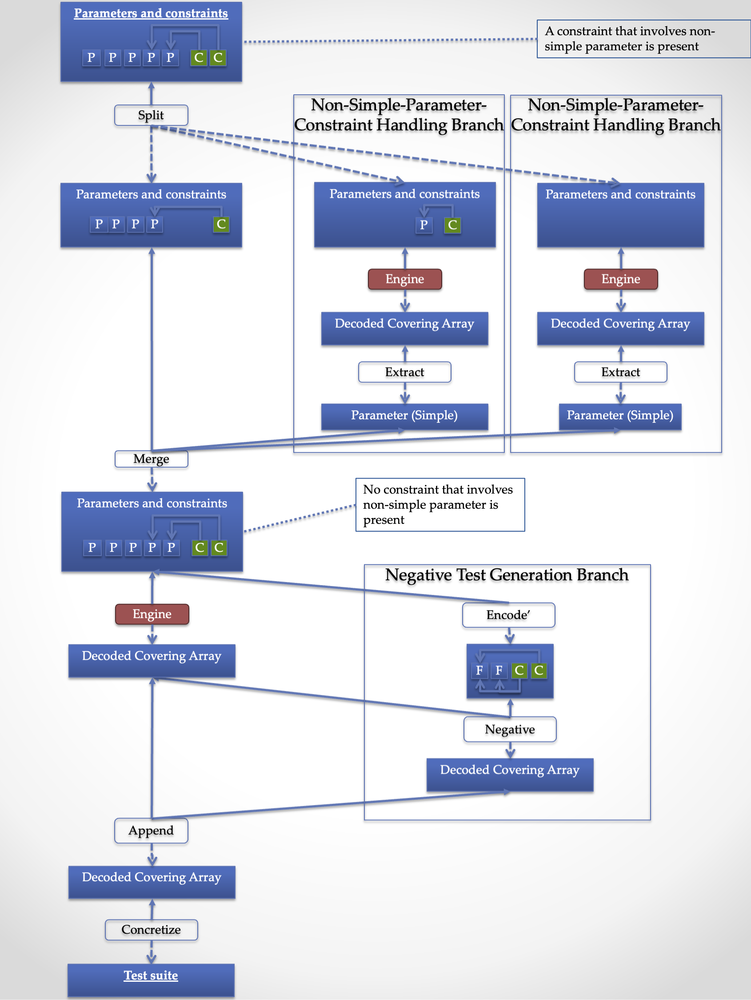

:toc:
:toclevels: 2
:doctype: book

= Design of JCUnit
== The Pipeline

JCUnit has a pipeline, which converts testing model containing user-defined parameters into an executable test suite.
Basic idea of it is following:
First, it converts the user-defined (human-understandable, high-level) parameters into factors and constraints, which can be processed by covering array generation engines.
Then, a covering array is generated from them.
Finally, the covering array is converted back to a test suite expressed in the human-understandable and high-level notation.

In order to provide popular features of CIT tools (such as seeding and negative testing) and practical performance under practical situations based on the idea, the pipeline has a carefully designed internal structure.
First, the pipeline has two levels, which are "Coordination" pipeline and "Engine" pipeline.
In each pipeline, there are a few branches and several stages.

In this section, we are going to walk through these levels, branches, and stages.

== Coordination Pipeline

The core idea of JCUnit is to convert human understandable model into factors and constraints.
Let CIT engine do the test suite generation.
Then, convert the test suite back to human understandable form.

.Coordination Pipeline

=== Main Branch

In the main branch, at first a non-simple parameters under constraint is dispatched to a special branch for the sake of performance.
This stage is called "Split".
The non-simple parameters sent to the special branches are then merged to construct a single parameter space ("Merge" stage).

Then the parameter space is sent to the next stage to generate a covering array for regular tests.
At the same time, the parameter space is also sent to a branch for the negative test generation (<<NegativeTestGenerationBranch>>).

The test cases generated by the both branches are stored into one collection ("Append" stage).

Finally, test case object, which executes methods in the test class based on annotations, is constructed ("Concretize" stage).

[[NonSimpleParameterUnderConstraintBranch]]
=== Non-Simple-Parameter-Under-Constraint Branch

A "simple" parameter is directly converted into a factor and constraints that involve only simple parameters can be used in the generation stage without any conversion.

However, for non-simple-parameters, a different approach is required.
A constraint in JCUnit is implemented as a Java method which takes actual value of parameters the constraint are interested in.

[source,java]
----
public class ExampleTest {
  public static boolean areValidInputValues(@From("a") int a, @From("b") int b) {
    // ...
    return checkedResult;
  }
}
----

The constraint method is called many times during the covering array generation and it will make the performance impractical.
When the parameter is not a simple one, but a custom one (e.g., Regex), the parameter and constraint definition will look like following.

[source,java]
----
import com.github.dakusui.jcunit8.runners.junit4.annotations.Condition;

public class ExampleTest {
  @ParameterSource
  public Regex.Factory sequence() {
    return Regex.Factory.of("open deposit(deposit|withdraw|transfer){0,2}getBalance");
  }

  @Condition(constraint = true)
  public static boolean isDesiredSequence(List<String> sequence) {
    // ...
    return checkedResult;
  }
}
----

The problem is, in order to call this method during the covering array generation, it involves encoding and decoding between the parameter value and internal representation happens every time.
This is in general too much expensive since a covering array generation engine needs to invoke it a huge number of times to find a row that minimizes the size of the output covering array.

What JCUnit does in this branch is to first process each non-simple parameter under a constraint by applying the "Engine" pipeline (<<EnginePipeline>>) to the parameter.
Then turn the generated covering array into a simple parameter whose levels are rows in the array.

With this approach, we can avoid evaluating the expensive step (encode/decode) every time the generation engine requires.
Instead, it only needs to invoke it with the decoded value in the latter part of the main branch.

NOTE: As described above, the current version of JCUnit converts all the non-simple parameters into simple ones.
This approach results in an increase in the size of the final test suite.
This behavior is designed based on the assumption where the encode/decode is always too expensive for the covering array generation process, however in case the meta-model is simply enough or in case it is encoded into a simple parameter with too many possible values, it might be preferable not to follow this step.
Making it possible to enable/disable the non-simple-parameter-under-constraint conversion step based on the encode/decode cost is one of the planned future enhancements.

[[NegativeTestGenerationBranch]]
=== Negative Test Generation Branch

A negative test means a test that verifies the behavior of the system under test (SUT) for the unwanted input.
In the CIT context, such input combinations are excluded by constraints.

[source,java]
----
public class ExampleTest {
    @Given("!inputValuesAreValid")
    @Expected(ValidationFailed.class)
    public void whenPerformFunction$thenInvalidInputReported(@From("inputValue") String inputValue) {
        driver.performFunction();
    }
}
----

JCUnit has a special generator for negative tests.
For each constraint, it tries to generate a row (test case), which violates it and only it.
With this feature, you can write a test which verifies a behavior of SUT for unwanted input values by annotating a test method.

NOTE: Currently, for every constraint regardless of whether it is synthesized as a result of the "Encode" stage or manually defined.
However, it is sometimes pointless to generate a negative test for such a synthesized constraint.
That is, a meta-model sometimes needs to generate internal constraints whose violation only causes a testing side issue.
This limitation is being addressed under <<JCUnit-Issue-188>>.

[[EnginePipeline]]
== The "Engine" Pipeline

The "Engine" pipeline is responsible for generating a human-understandable test suite from a given human-understandable parameter model.

.Engine Pipeline
image:./design/ThePipeline/Slide2.png[]

It is a broad concern in the model-based testing to address a problem called "state-space explosion".
To address this the approach, the JCUnit applies a technique called "Combinatorial Interaction Testing" to generate a small test with a good coverage over the testing domain.

=== Stages

This inner pipeline mainly consists of five stages, "Encode", "Partition", "Generation", "Join", and "Decode".

The high-level (human-understandable) parameter model is encoded into a model based on factors and constraints only in the first stage called "Encode".
The encoded factors and parameters are partitioned for the sake of scalability and flexibility.
For each partitioned group of factors and constraints, "Generation" stage, where CIT engine is executed to generate a mathematical object called a "covering array", is executed.

Then, covering arrays are connected by the "Join" stage.
As of today, the only practical way to construct a new covering array from existing ones without relying on covering array generation engine is a technique called "Combinatorial Join".
We use this technique in this stage.

Finally, the connected covering array is converted into the human-readable form by "Decode" stage.

In this section, we walk through the stages in the"Engine" pipeline, one by one.

=== Encode

This is a stage, where a parameter defined using a meta-model is converted into a set of factors and constraints.
The encoding procedure is provided as a part of each meta-model implementation.
Thanks to having this stage, JCUnit can handle various meta-models such as Input-parameter Model, Finite State Machines (FSM) Model, Regular Expression sequence, and so on.

NOTE: Users of JCUnit can define arbitrary "meta-model" to define their testing model.
The meta-model is required to implement "encode" and "decode" operations.
"Encode" is responsible for encoding a model defined using the meta-model into factor-constraint model.
"Decode" is the other way around.

Depending on the design of the conversion specification, the number of factors and complexity of the constraints can be completely different.

JCUnit supports three meta-models out of box, which are finite state machines (FSM), regular expressions (Regex), and simple input parameters.
The design of the conversion by JCUnit can be found in the paper we published 2017<<TestDesignAsCode>>.

=== Partition

"Partition" stage splits a given set of factors and constraints into groups each of which no constraint references a factor outside the group.
This stage allows us two things.
One is to apply the "best" covering array generation engine for each group.
The other is to be able to mitigate the exponential growth of generation time along with the number of factors/the complexity of constraints.

NOTE: The default implementation for the "Partition" stage, extracts a group of factors which are not referenced by any constraints, first.
Then, it groups factors by constraints in the following manner.
It picks up one constraint and checks each factor if the factor is referenced by another constraint.
If it is, mark the factor and the check happens recursively for the referencing constraint.
Once this process is finished, the marked factors are extracted as a new group and the checked constraints are removed.
Until all the constraints are removed, the process is repeated.

The intention of this mechanism is to allow "divide-and-conquer" in the covering array generation process.
The encoding procedure may multiply the number of the factors and constraints.
Although the modern covering array generation engines are very scalable along with the number of factors, however, if once a constraint is introduced, the performance is drastically worsen, sometimes<<PICT-Issue-13>>.
JCUnit can mitigate this problem by this and "Join" mechanism.
Another benefit of having this step is to be able to choose the "best" covering array engine for each group.
For instance, when constraints are present, ACTS is faster than PICT.
However, if the constraints are not simple ones but relying on Java's feature to check the value's validity, JCUnit's built-in covering array engine will be the only choice, even if it is slowest among those three.

You should also keep in ming that the "Join" stage causes a significant "size penalty", where covering array size is increased significantly for each combinatorial join operation.

=== Generation

"Generation" is the stage, where a covering array is generated from factors and constraints.
As long as the factors and constraints can be handled, the engine implementation is replaceable.<<JCUnit-Issue-179>>

=== Join

JCUnit employs an operation called "Combinatorial Join"<<CombinatorialJoin>><<WP-CombinatorialJoin>> to construct a new covering arrays from existing ones not relying on a covering array generation array engine.
Since the combinatorial join operation can take onlyt two covering arrays as input, this stage is applied repeatedly.

However, it is very difficult to find a way to connect multiple covering arrays to construct a bigger covering array without creating a new row before "combinatorial join".
An instance for it is to treat an input covering array as a factor and each row in it as a level of the factor<<Zamansky-2017>>.
In an industry scale setting, this results in an unacceptably huge covering array.

In order to address this problem, the developers of JCUnit, came up with operations called "combinatorial join"<<CombinatorialJoin>><<WP-CombinatorialJoin>>.
It constructs a new covering array from existing two covering arrays.
With this operation, we can accelerate the covering array generation process even if there are a large number of factors and complex constraints.
Nevertheless, the operation introduces an increase in the output size, which we call "size penalty".
Also, the characteristics of the size penalty has not been studied well.
The optimal order to perform the combinatorial join operation for more than two covering arrays is subject to future studies.

By default, the JCUnit's framework chooses the largest (the array that has the most rows) arrays repeatedly to construct a final covering array.

NOTE: Thanks to the "partition" stage, it becomes able to "divide" a large testing space (i.e, the large number of factors and constraints) into smaller groups.
From each sub-problem is "conquered", if we can construct the desired artifact, one covering array that covers all the given factors under all the given constraints, the entire problem can be said solved.

=== Decode

"Decode" stage is responsible for convert the test cases generated using the levels back into the high-level representation, i.e., a concrete value of the concrete value of a parameter given to "Encode" stage.
The decoding procedure is provided as a part of each meta-model implementation.

== References

- [[PICT-Issue-13]] https://github.com/Microsoft/pict/issues/13[Endless calculation with following model]
- [[Zamansky-2017]] https://ieeexplore.ieee.org/document/7899062[A Composition-Based Method for Combinatorial Test Design]

=== Our papers
- [[TestDesignAsCode]] https://ieeexplore.ieee.org/document/7928008[Test Design as Code: JCUnit]
- [[CombinatorialJoin]] https://ieeexplore.ieee.org/document/8728961[Reduce Test Cost by Reusing Test Oracles through Combinatorial Join]
- [[WP-CombinatorialJoin]] https://peerj.com/articles/cs-720.pdf[Accelerating covering array generation by combinatorial join for industry scale software testing]

=== JCUnit Tickets
- [[JCUnit-Issue-179]] https://github.com/dakusui/jcunit/issues/179[#179: Integrate PICT as a covering array generation engine]
- [[JCUnit-Issue-188]] https://github.com/dakusui/jcunit/issues/188[#188: Make it possible to specify whether a negative test should be generated for each constraint]
- [[JCUnit-Issue-189]] https://github.com/dakusui/jcunit/issues/189[#189: Make non-simple-parameter-under-constraint simplifying feature switchable based on cost]
